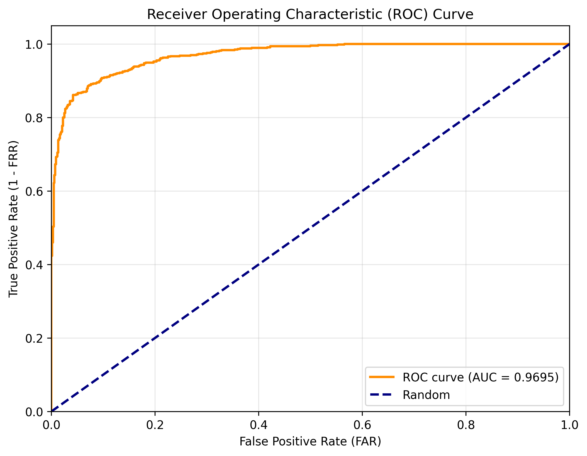

# BiLSTM-Attention Online Signature Verification

Implementation of [A Stroke-Based RNN for Writer-Independent Online Signature Verification](https://ieeexplore.ieee.org/document/xxx) on SVC2004 Task2.

## Results

| | Val | Test |
|---|---|---|
| Accuracy | 90.39% | 90.07% |
| EER | 9.83% | 9.55% |
| AUC | 0.9654 | 0.9695 |

ROC curve:



## Requirements

Python 3.8, TensorFlow 2.9

```bash
conda create -n sig38 python=3.8 -y
conda activate sig38
pip install tensorflow==2.9.0
pip install -r requirements.txt
```

## Quick Start

预训练权重已放在 `checkpoints/best_model.h5`，可以直接跑推理。

```bash
python scripts/inference.py \
    --sig1 path/to/sig1.TXT \
    --sig2 path/to/sig2.TXT \
    --checkpoint checkpoints/best_model.h5
```

输出：
```
相似度分数: 0.9999
验证结果:   真签名 (Genuine)
```

## Training from Scratch

**1. 准备数据**

把 SVC2004 Task2 数据放到 `raw_data/SVC2004_Task2/`，然后：

```bash
python scripts/preprocess.py --data_root ./raw_data/SVC2004_Task2
```

**2. 训练**

```bash
python scripts/train.py --config config/train.yaml
```

**3. 测试集评估**

```bash
python scripts/batch_inference.py \
    --checkpoint checkpoints/best_model.h5 \
    --test_list outputs/features/test_list.txt \
    --output_dir outputs/results
```

## API

```bash
python api/app.py
```

```bash
curl -X POST http://localhost:5000/verify \
  -F "sig1=@sig1.TXT" -F "sig2=@sig2.TXT"
# {"score": 0.9999, "result": "genuine"}
```

## Model

孪生网络结构，两路共享 BiLSTM（2层，hidden=256）+ Attention 提取特征，Concat 拼接后全连接层输出相似度。输入为 23 维时序特征，序列统一截断/补零至长度 400。
